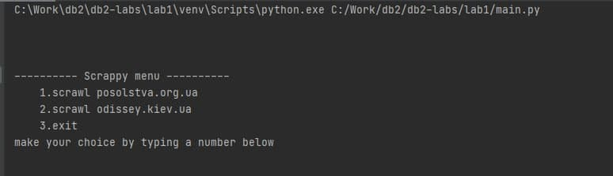
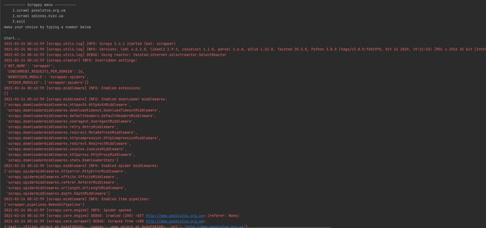
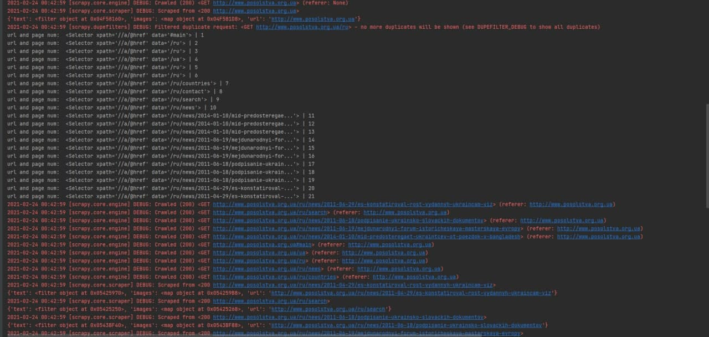
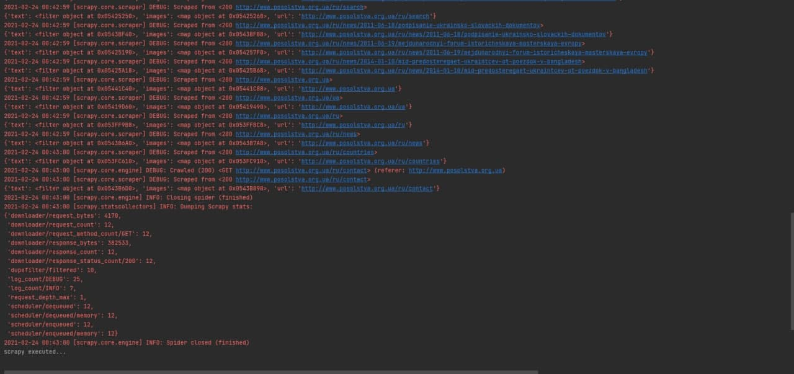
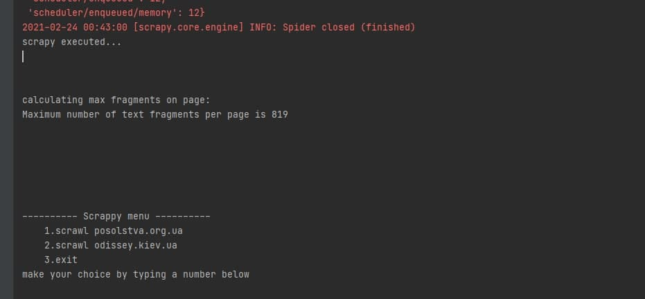
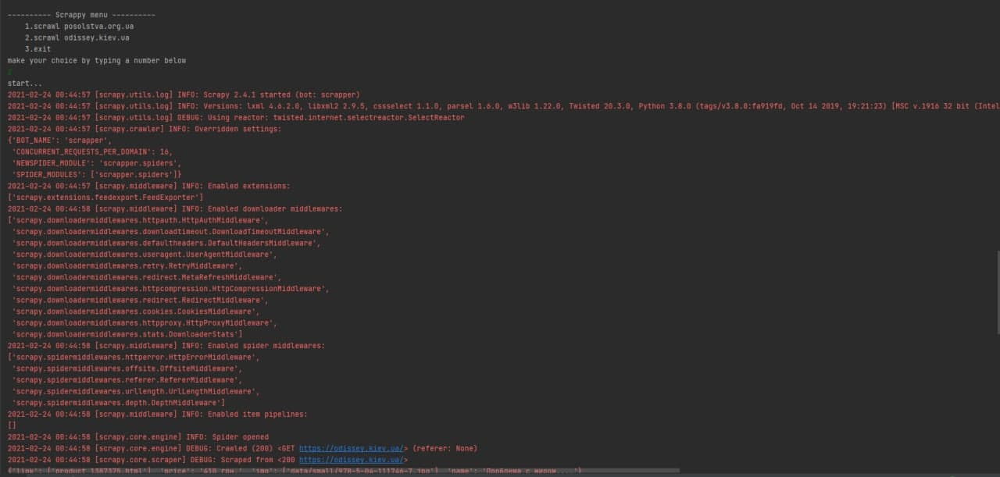
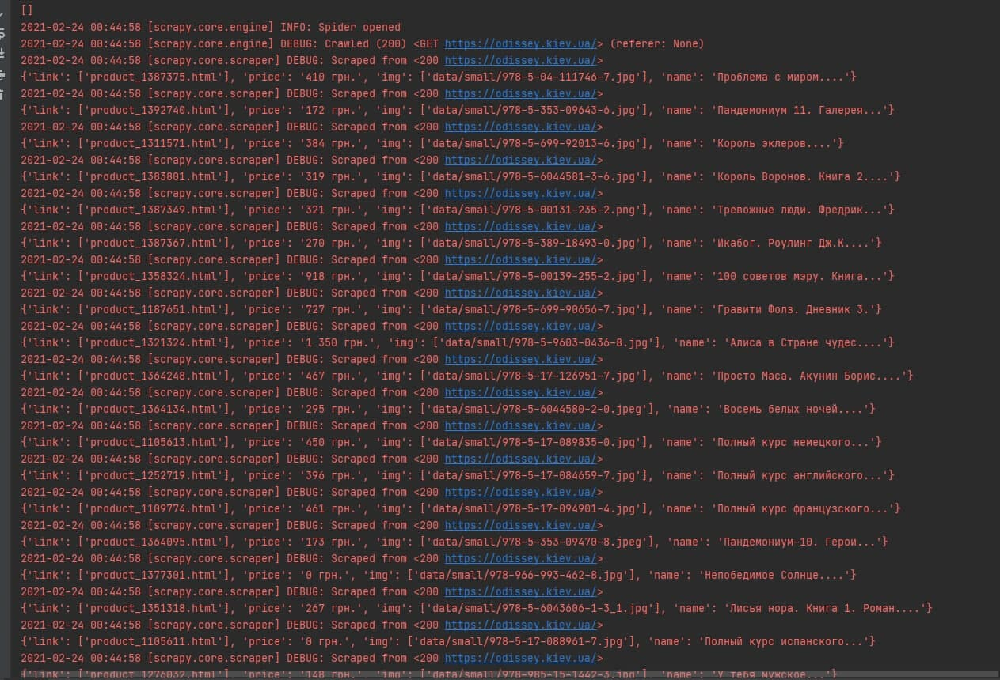
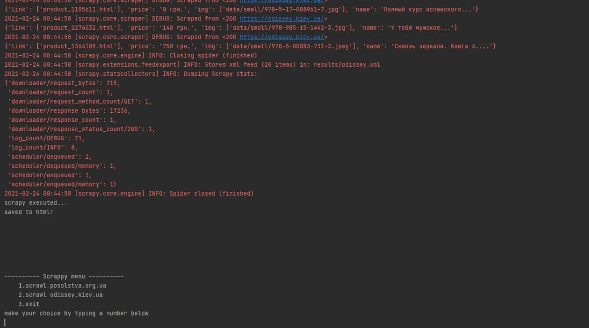
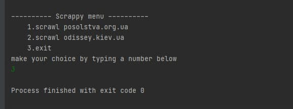

#Prepared by Podlesniuk Bohdan KP-81
# Lab 1. Вивчення базових операцій обробки XML-документів
## Variant 16:
Базова сторінка (завдання 1) | Зміст завдання 2 | Адреса інтернет-магазину(завдання 3)
------------ | ------------- | -------------
www.posolstva.org.ua | Максимальна кількість текстових фрагментів | www.odissey.kiev.ua

##Posolstva.org.ua scrawling

Firstly, we scrape data from website and convert it to xml.
Then we calculate maximum occurrence of text fragments per page

##Odissey.kyiv.ua scrawling

Website is scraped and formed into xml.
After that html file is generated from xml based on xslt

##Exit showcase
