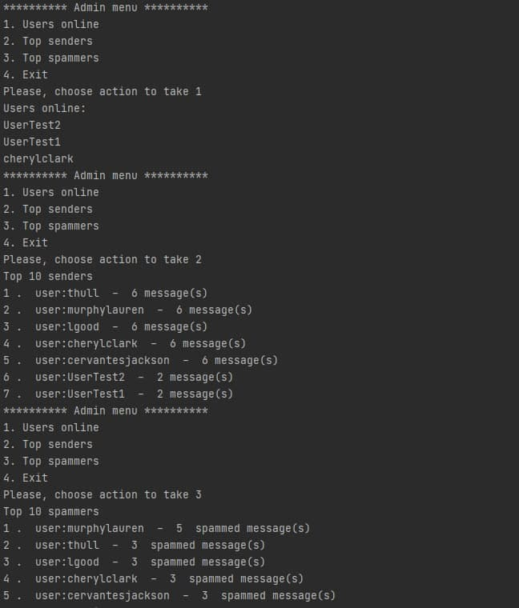

# Лабораторна робота 2.
# Подлеснюк Богдан Анатолійович. Група КП-81

## Тема:
Практика використання серверу Redis
## Мета роботи:
Здобуття практичних навичок створення ефективних програм,
орієнтованих на використання сервера Redis за допомогою мови Python.

## Завдання
[Посилання на завдання](http://scs.kpi.ua/sites/default/files/lab2_bd2-db2019_2020.pdf)

## Звіт
[Посилання на звіт](DB2_Lab2_Report_Podlesniuk_Bogdan.pdf)

## Обгрунтування вибору структур даних в redis
Хештаблиця - була використана для зберігання повідомлень. Основна причина в тому, що хештаблиця дозволяє зберігати id
повідомлення як ключ та ім'я користувача-відправника, користувача-отримувача, текст повідомлення як значення.

Сет - був використаний для зберігання користувачів, так как як нам важливо, щоб кожен користувач був унікальним.
Перевага була надана саме звичайному сету через те, що нам не важливий порядок користувачів, але є важлива швидкість доступу до них.

Сортований сет - використовується для збереження топ спаммерів, так як нам є важливо задати для спаммерів порядок за кількістю спам повідомлень. 

Список - використовується для черги повідомлень, так як нам є важливий порядок доданих записів, та час додавання та вилучення,
який у випадку використання List є константним

## Приклади роботи програми

Приклад роботи додатку для користувача:
Реєструємо користувача, авторизуємось та відправляємо повідомлення іншому користувачу.
Після цього worker повинен перевірити повідомлення на спам, щоб воно успішно дійшло до іншого користувача

Приклад роботи додатку для адміністратора:

Приклад спаму:

Приклад логів, які залишає додаток:

